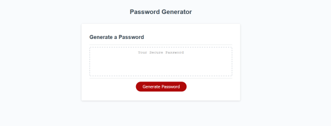
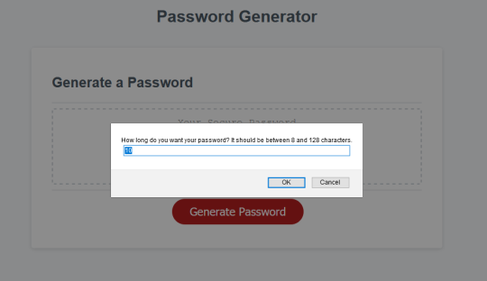

# JavaScript Password Generator
A simple generator to create passwords given criteria regarding which characters to include.

## Details
On click of the "generate" button, the user is prompted with a series of alerts/prompts/confirms that determine the user's preference for length and types of character to include. 

## Usage
    -Click the "generate" button.
    -In the prompts, enter a preferred length (values outside of 8-128 will not be accepted), then whether to include lowercase letters, uppercase letters, numbers, and special characters (choosing no types of character will result in a message along the lines of "no valid password").
    -Newly generated password will be written to the text field.
    -Process can be repeated with another click of the "generate" button.

## Deployed Link
Application is deployed on GitHub Pages at: https://bnemeton.github.io/JS-PW-gen/

## Screenshots

